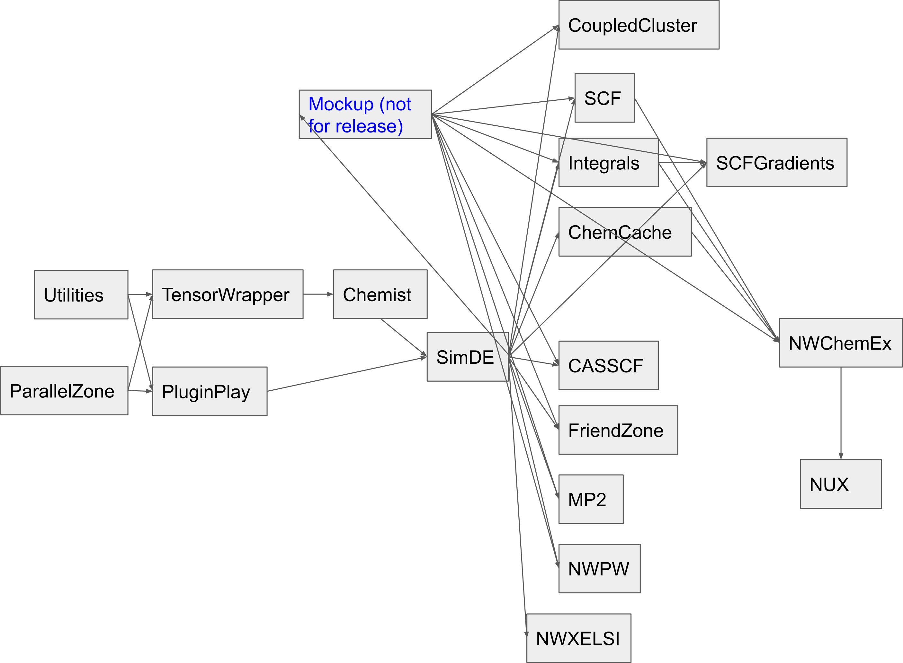

**********************************************************
Docker-image-based Continuous Integration (CI) of NWChemEx
**********************************************************

Overview
================

NWChemEx uses GitHub Actions to run the CI workflows. Here are a few useful 
tutorials on workflows in GitHub:

- `Quickstart for GitHub Actions <https://docs.github.com/en/actions/quickstart>`__
- `GitHub Actions Tutorial, From Zero to Hero in 90 minutes <https://www.youtube.com/watch?v=TLB5MY9BBa4>`__

NWChemEx has a lot of repositories. In order to build and test a repository,
a working environment should be ready for these tasks. Specifically, one has to
install

1. The required external (non-NWChemEx) packages. For example, the GCC compiler
   and the MPI library.
2. The dependent NWChemEx repositories. For example, ``PluginPlay`` depends on
   ``Utilities`` and ``ParallelZone``.

Some external packages, such as GCC and Catch2 are shared by every repository,
and there are other packages shared by many repositories. Moreover, some
repositories have duplicated set of external packages. For example, the external
packages of ``TensorWrapper`` and ``Chemist`` are the same.

In the conventional CI of NWChemEx, the external packages are installed 
on-the-fly, which is a waste of time, considering many these packages can be
shared by many repositories. For the dependent NWChemEx repositories, compiling
and installing them at runtime is also very inefficient.

Our solution to the efficiency problem is to build the external packages and
the dependent NWChemEx repositories into docker images, and use those pre-built
docker images to speed up the CI process.

The Ideas in the Design
=======================

The main purpose to build a CI system based on docker images is to reduce the
building time for every repo. After some trial and error, the following
considerations have been adopted in the design:

1. For each repo two types of docker images are built and stored in the
   `GitHub container regestiry <https://docs.github.com/en/packages/working-with-a-github-packages-registry/working-with-the-container-registry>`__:

   a. The **base image**. This images contains all external (non-NWX) packages 
      necessary to build and test the repo.
   b. The **release image**. The installed version of the repo which can be used 
      by other repos.
2. For each base image, there are two tagged versions:

   a. The "**latest**" version. This version of the base image contains the 
      latest updates of the settings of the external packages (e. g., a new 
      version no. of an external package). The "latest" version of the base 
      image has been tested within its repo but not fully tested in other repos.
   b. The "**stable**" version. This version of the base image has been tested 
      both in its repo and other repos which depend on this repo.
3. When a repository is successfully compiled and all tests pass, its release
   images would be built and pushed to the GitHub registry. For each release 
   image, we also have the "latest" and "stable" versions. 
   However, since we want to build and test with different compilers such as 
   GCC and Clang, four different tags such as "**gcc-latest**", "**gcc-stable**"
   ,"**clang-latest**", and "**clang-stable**" would be asigned to the release
   image.
4. For repositories depending on other NWChemEx repositories, a docker image 
   for building/testing is constructed on-the-fly in a 
   `GitHub docker container action <https://docs.github.com/en/actions/creating-actions/creating-a-docker-container-action>`__ 
   by pulling the corresponding base image and release images of the dependent 
   NWChemEx repositories. This transient building image is not necessary to be 
   stored and maintained.
5. The dependency relations of NWChemEx repositories are illustrated in the 
   following diagram, in which an arrow from repository A to repository B means
   B depends on A. We also call A the "**upstream repository**" and B the 
   "**downstream repository**".

   Dependency of NWChemEx Repositories

6. In daily CI tasks triggered by opening a pull request, only the "latest" 
   versions of the base and the release images would be updated. When necessary
   (should be done with caution!), a manually triggered workflow can also be
   called to update the stable images. Now we have put blank test files under 
   the directories for the **integration tests** as place holders. In the 
   future releastic integration tests will be filled in. As an ultimate 
   examination, a routine workflow to check the consistency of all base and 
   release images (upstream repositories do not break downstream repositories) 
   will be run in the case of a major release of NWChemEx (TODO!).

The Details of the Workflows
============================

To build the base images first, the workflow ``base_image_gcc-clang-cmake.yaml``
has been added into the ``.github`` repository and the workflow ``build_base.yaml``
has also been added into each working repository. In the workflow ``build_test_release.yaml``
in each repository the building/testing/releasing tasks are done. The workflow 
``build_test_release-manual.yaml`` is to update the stable images manually. The
details of these workflows can be explained as the following:

1. ``base_image_gcc-clang-cmake.yaml``
--------------------------------------

In this workflow, a base image with the most common external packages (e. g., 
GCC, Clang, CMake etc) is built with the action ``image-install_package`` in the 
``.github`` repository. To decouple all packages, each call of the action 
``image-install_package`` only install one package. The details of how to 
install the packages can be found in the docker files under the ``Dockerfile``
directory in the ``.github`` repository.

2. ``base_build.yaml``
----------------------

In this workflow, the repository-specific necessary external packages are 
installed on top of the base image built in ``base_image_gcc-clang-cmake.yaml``,
and finally the base image for the specific repository is built. The 
installation is also accomplished through the ``image-install_package`` action 
in a stepwise way and controlled by the docker files under the directory 
``.github/Dockerfile/`` in the specific repository.

We want to note updating the base images is not part of the daily work for CI 
(otherwise CI does not benefit from using docker images),
so these base images are relative stable and get updated only when necessary.

3. ``build_test_release.yaml``
------------------------------

This is the key workflow for the building/testing/releasing tasks. In the 
workflow the following jobs are run in sequence:

a. ``docker-file-changes``. 
   This job detects if there is any updates in the files under the directory 
   ``.github/Dockerfile/``.

b. ``update-base-image``. 
   If any file in ``.github/Dockerfile/`` has been changed, this job call the 
   workflow ``base_build.yaml`` to update the base image.

c. ``build_update_check``. 
   This job runs in parallel with ``update-base-image``. If any file in 
   ``.github/Dockerfile/`` has been changed, the tag of the base image is 
   "latest", otherwise a tag "stable" is generated.

d. ``build_test_release-gcc`` and ``build_test_release-clang``.
   These are the key jobs, in which building/testing is done with GCC and Clang,
   respectively. If the compilation is successful and all tests pass, two 
   release images tagged as "gcc-latest" and "clang-latest" are built and 
   pushed into the GitHub registry. All building/testing/releasing tasks are 
   done in docker containers.
   
   The key component of these jobs is calling the container action ``container-build_test_release``
   under the directory ``.github/actions`` in each repository. Since the 
   official GitHub container actions do not support controlling how to build 
   the image, on which the container is based, with building arguments, writing
   a container action to acomplish all building/testing/releasing tasks is 
   challenging. Finally we adopted the idea of `Javier Zolotarchuk <https://github.com/JavierZolotarchuk/parameterizable-docker-action-example>`__
   and developed a "docker-in-docker"-like container action. In this action an
   outer container is built simply to pass the building arguments to the inner
   container, in which the actual work of building/testing is done. In the 
   ``entrypoint.sh`` script of the outer container, the base image of the 
   corresponding NWChemEx repository and the possible dependent release images
   of other NWChemEx repositories are pulled and a transient building image of
   this repository is constructed. Moreover, in the ``build_test.sh`` script of
   the inner container, all building/testing work is done. In order to pass 
   variables into ``build_test.sh``, all building arguments passed from the 
   outer container should be assigned as environment variables. We want to note 
   since the docker daemon cannot be accessed in the inner container, we 
   release the installed repository as an image in the last lines of the 
   ``entrypoint.sh`` script of the outer container.

4. ``build_test_release-manual.yaml``
-------------------------------------

As we explained before, this manually triggered workflow is for updating the 
stable images when necessary. Please be careful in running this workflow since
images can only be considered fully stable after a thorough check on all 
relevant downstream repositories. This workflow is mainly for debugging purpose.
One is not recommended to run this workflow routinely since a workflow to check 
the consistency of all "latest" images and update all "stable" images regularly 
is to be developed.

Open Questions
==============

1. dev/master model implementation
----------------------------------

The dev/master model, which had been `discussed <https://github.com/NWChemEx-Project/ParallelZone/issues/108>`__,
has not been implemented at this time. However, the corresponding workflows 
have been developed and could be checked in if we finally decide to move to 
this model. Combining docker images with this model, we may use the "latest" 
images for all work in the ``dev`` branch to test the up-to-date new features 
and "stable" images in the ``master`` branch to keep the consistency.

2. Debug and Release build mode
-------------------------------

Now we only build and test the codes in the release mode (the only exception is
the ``Mokup`` repository, for which a Release build takes extremly long time).
To fully test the codes (some bugs may not be exposed in a Release build), we
may need to build and test the codes in the Debug mode. This can be easily done
by passing a new building argument on the building mode to the container action.

3. Package version no.s management
----------------------------------

Now for simplicity all package version no.s are hardwired in the workflows. 
This information should be retrieved from some files, e. g., ``https://github.com/NWChemEx-Project/NWXCMake/blob/master/cmake/nwx_versions.cmake``.
Actions will be written for such tasks.

