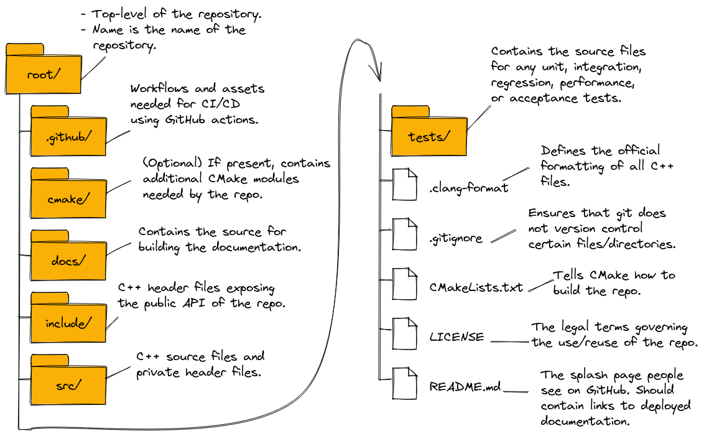
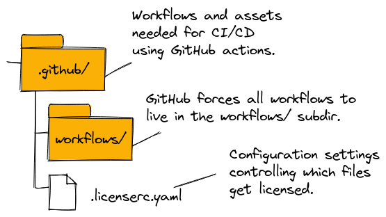
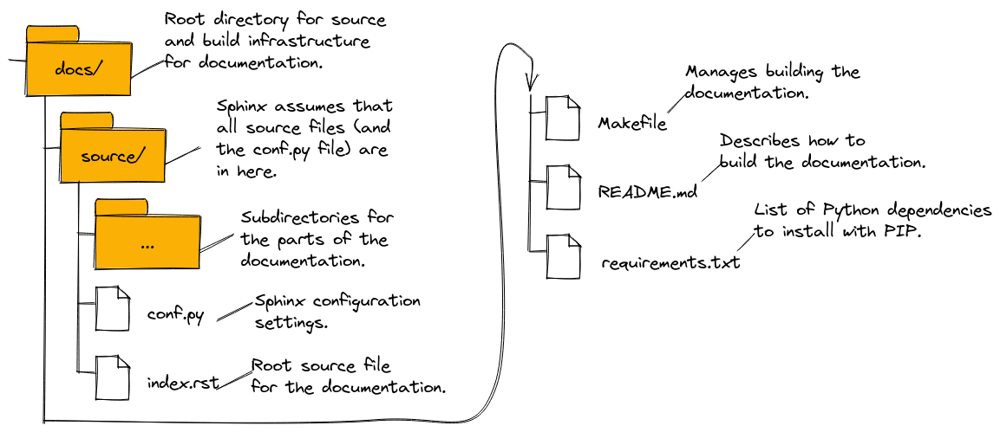

.. Copyright 2022 NWChemEx-Project
..
.. Licensed under the Apache License, Version 2.0 (the "License");
.. you may not use this file except in compliance with the License.
.. You may obtain a copy of the License at
..
.. http://www.apache.org/licenses/LICENSE-2.0
..
.. Unless required by applicable law or agreed to in writing, software
.. distributed under the License is distributed on an "AS IS" BASIS,
.. WITHOUT WARRANTIES OR CONDITIONS OF ANY KIND, either express or implied.
.. See the License for the specific language governing permissions and
.. limitations under the License.

########################################
File Structure for NWChemEx Repositories
########################################

To the extent possible, we want all NWChemEx repositories to follow the same
file structure. Since each repo in the organization is ultimately different,
it will in general not be possible for every repo to be laid out exactly the
same; however, we strive to only deviate from the standard layout when
absolutely necessary.

*****************************************************
Why Do We Need to Standardize the Repository Layouts?
*****************************************************

Admittedly, the repository layout adopted by all repositories in the NWChemEx
organization was chosen based on personal preference of the lead developers.
However, now that a standard has been agreed upon it is important that we
adhere to it. In particular, by standardizing the file layout of each
repo we are able to facilitate:

- Confidence. Well laid out repositories instill a more professional impression
  on anyone viewing the repository's files.
- Finding files. Users/developers familiar with the layout of one NWChemEx
  repository can quickly and easily find files in another.
- Automation. If all the repositories are laid out the same it is much easier
  for CI/CD to maintain them.
- On-boarding new developers. Where possible our layouts adhere to wider
  file system standards, standards which are familiar to many developers outside
  the NWChemEx organization. By adhering to such standard we lower the barrier
  to entry for new developers.

***********************
File Naming Conventions
***********************

- To avoid pitfalls related to differences in operating system behavior, all
  files should be "lower_snake_case", i.e., all lowercase letters, underscores
  for separating words.
- It is strongly recommended you stick to letters, numbers, and underscores
  only. Notably avoid symbols like ``*``, ``?``, ``(``, ``)``, ``'``,
  and ``"``.

Extensions
==========

- C++ header files end with ``*.hpp``, e.g., ``file_name.hpp``.
- C++ source files end with ``*.cpp``, e.g., ``file_name.cpp``.
- C++ inline implementation files end with ``*.ipp``, e.g., ``file_name.ipp``.
- CMake modules end with ``*.cmake``, e.g., ``file_name.cmake``.
- (GitHub-flavored) Markdown end with ``*.md``, e.g., ``file_name.md``.
- Python source files end with ``.py``, e.g., ``file_name.py``.
- ReStructured Text files end with ``.rst``, e.g., ``file_name.py``.

Exceptions
==========

The following exceptions to the above file naming conventions are allowed:

- CMake build systems should be stored in one or more ``CMakeLists.txt``.
  - Reason for exception: CMake convention.

*********************
Files and Directories
*********************

In this section we provide a top-down tour of a typical NWChemEx repository's
file structure.

Root Level
==========

.. _fig_root_level_files:

   How most (although ideally it should be all) repositories in the NWChemEx-
   Project organization look at the root level.

At the root level, most (although it should ideally be all) repositories in the
NWChemEx organization conform to the layout shown in
:numref:`fig_root_level_files`. As a quick internet search will show (see for
example `here <tinyurl.com/4h95tudm>`__) this layout is fairly standard, albeit
universal. We note that using our layout, the only files residing at the
root-level of the repository are there either because they must live at the
root-level (*e.g.*, ``.clang-format``), or are present at the root-level to
emphasize they apply repository wide (*e.g.*, ``LICENSE``).

.. note::

   A notable (well explained) argument against our chosen layout can be found
   `here
   <https://www.open-std.org/jtc1/sc22/wg21/docs/papers/2018/p1204r0.html>`__.

.github Directory
=================

.. _fig_github_files:

   Basic structure of the ``root/.github/`` directory in most NWChemEx
   repositories.

:numref:`fig_github_files` shows the layout of the ``.github/`` directory in
nearly every repository owned by the NWChemEx organization. The layout
and naming conventions are dictated by GitHub and are thus commonly found in
most GitHub projects.

docs/ Directory
===============

.. _fig_docs_files:

   Basic structure of the ``root/docs/`` directory in most NWChemEx
   repositories.

The set-up of the directory is driven by Sphinx, which by default assumes all
documentation source lives in ``root/docs/source/``, the configuration file for
Sphinx resides at ``root/docs/source/conf.py``, and automatically creates the
``root/docs/Makefile`` file to facilitate building the documentation. The
remaining files, ``root/docs/requirements.txt`` and ``root/docs/README.md`` are
to respectively facilitate obtaining the dependencies of the documentation and
to instruct the reader on how to build the documentation.
