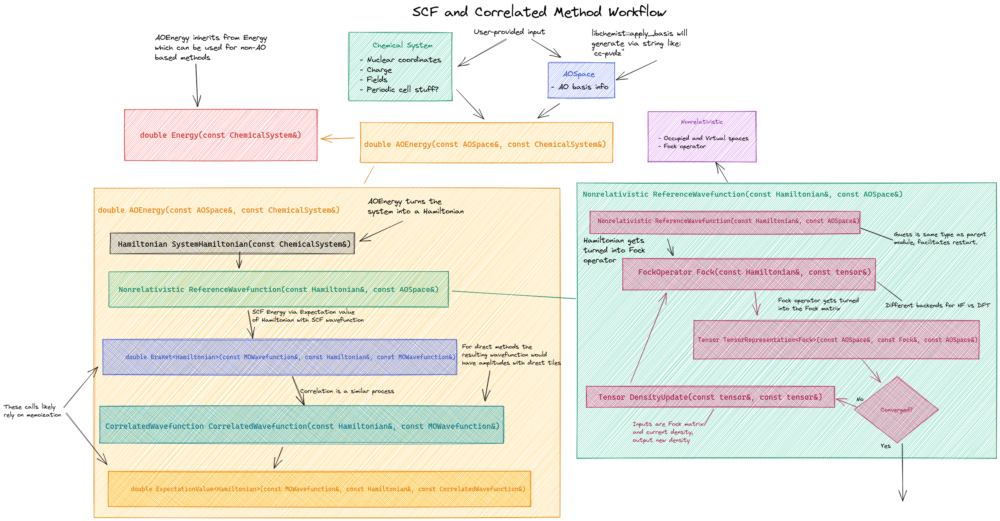

***************
Energy Workflow
***************

Arguably the most common calculation performed in an electronic structure
package is the computation of a chemical system's energy. The point of this
page is to discuss the design of how NWChemEx handles the energy workflow.

   Schematic of how NWChemEx computes an energy.
