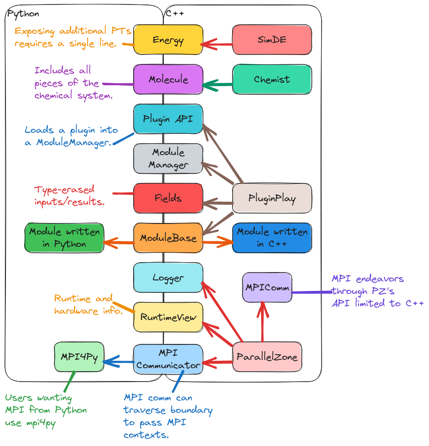
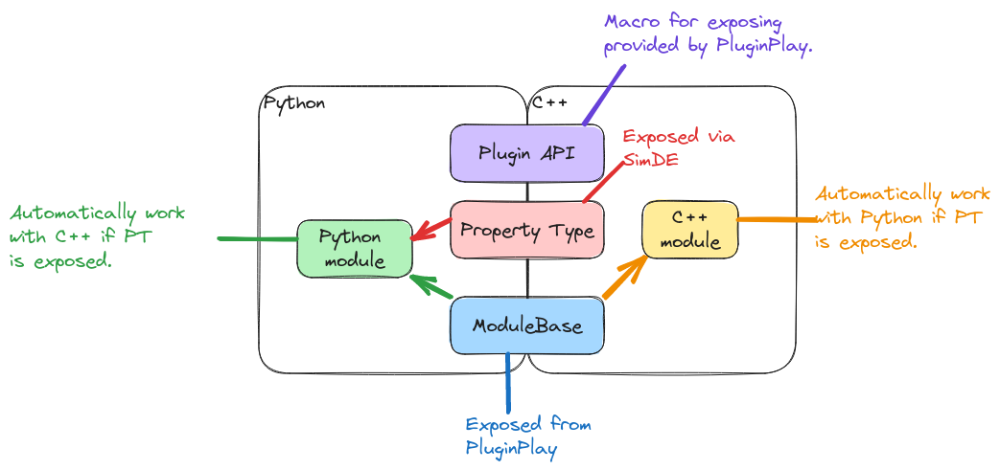
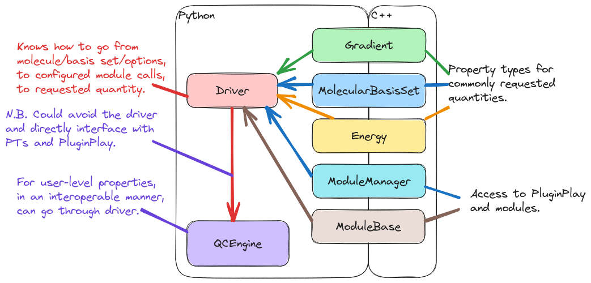

.. Copyright 2025 NWChemEx-Project
..
.. Licensed under the Apache License, Version 2.0 (the "License");
.. you may not use this file except in compliance with the License.
.. You may obtain a copy of the License at
..
.. http://www.apache.org/licenses/LICENSE-2.0
..
.. Unless required by applicable law or agreed to in writing, software
.. distributed under the License is distributed on an "AS IS" BASIS,
.. WITHOUT WARRANTIES OR CONDITIONS OF ANY KIND, either express or implied.
.. See the License for the specific language governing permissions and
.. limitations under the License.

#########################################
Design of the Python Binding Architecture
#########################################

Section :ref:`why_is_the_nwchemex_api_written_in_python` discusses why we want
a Python API for NWChemEx. This page records the decisions which went into
designing NWChemEx's Python bindings.

*************************
What are Python bindings?
*************************

Presently, by "Python bindings" we are specifically referring to code forming
an interoperability layer between C/C++ code and Python. This layer allows
Python objects, functions, data, etc. to seamlessly interact with C++ objects,
functions, data, etc. and vice versa.

*******************************
Why do we need Python bindings?
*******************************

Following from the design discussion in
:ref:`why_is_the_nwchemex_api_written_in_python`, NWChemEx's high-level API is
assumed to be Python-based, but the guts of NWChemEx are written in C++. Hence,
to expose the C++ guts to Python we will need to write Python bindings.

.. _pb_considerations:

*****************************
Python Binding Considerations
*****************************

In creating our Python bindings, and choosing the library to help us create the
bindings, we have identified the following considerations:

.. _pb_diff_lang:

Different languages
   Fundamentally Python and C++ are different coding languages. They rely on
   different assumptions, have different designs, are fundamentally
   implemented different, and embrace different coding paradigms. The point is
   there is no perfect one-to-one mapping between C++ and Python and the
   developer may need to step in to ensure the conversion happens in the manner
   best aligned with the specific interface.

   - While Python and C++ have no one-to-one mapping, the reality is that there
     is a "pretty obvious" mapping for many of the features. Our solution should
     be easy to apply, if not automatic, for such features.

.. _pb_features:

Full featured
   We expect that C++ developers will use the full extent of the C++ language
   and that Python developers will too. We thus reject solutions which require
   the developer to limit the features they use throughout the code.

   - Combined with :ref:`pb_diff_lang` we must also acknowledge that at the
     C++/Python API we may need to limit language features in order to perform
     the handoff. Once the handoff is accomplished, solutions which satisfy
     :ref:`pb_features` will allow users to resume using the full feature set
     of the respective language.

.. _pb_native_apis:

Native APIs
   C++ APIs should be defined purely using C++, and Python bindings should be
   defined purely with Python. Any conversions needed to go from one language to
   the other should happen under the hood.

   - In practical terms, this means that Python users should not need to worry
     about pointers, templates, references, etc. and C++ users should not
     have to worry about the GIL (Python's global interpreter lock), garbage
     collection (on the Python side), etc.

.. _pb_minimally_invasive:

Minimally invasive
   Ideally Python bindings should be created in the least invasive manner
   possible. The ideal solution will live organically with the existing C++
   source files or exist in Python. Namely we want to avoid solutions which
   require us to rely on too many external tools, or intermediate markup
   languages.

   - We particularly want to avoid source-to-source translators as they have a
     tendency to have underwhelming performance and limited feature sets.
   - As a corollary, it is fine if the tool internally uses an intermediate
     representation; :ref:`pb_minimally_invasive` is really focused on avoiding
     making the developer produce a representation of the code in a language
     other than C++ or Python.

.. _pb_maintainable:

Easily maintained
   As NWChemEx grows we expect the API to grow as well. Python bindings will
   need to be created for the new APIs and ideally whatever Python binding
   solution we go with should be accessible to developers and easily extendable.

.. _pb_supported:

Active support
   Our goal is for the Python bindings of NWChemEx to live for as long as the
   NWChemEx project does. This requires our Python binding solution to also be
   maintained over the course of this time period. The ideal solution should be
   well supported, not only in terms of development, but also in terms of
   documentation and/or StackOverflow-like help.

.. _pb_existing_choices:

****************
Existing Choices
****************

Writing bindings directly with Python's C API is a tedious task. For that
reason, a variety of software libraries/packages have been created with the
intent of aiding in generating Python bindings. They are listed below (in
alphabetical order) along with brief summaries.

.. note::

   Obligatory disclaimer. We are NOT experts in all of the packages listed in
   this section. The summaries have been assembled based on documentation and
   examples provided by the packages. We have done our best to accurately
   reflect the state of these packages, but it is possible that what we have
   inferred does not actually represent the state of the packages. We also
   acknowledge that the descriptions for packages we have used are heavily
   biased based on our experiences with those packages.

Boost.Python
============

- GitHub: https://github.com/boostorg/python

  - 28 watchers
  - 396 stars

- Docs: http://boostorg.github.io/python/doc/html/index.html

Boost.Python was one of the "OG" binding libraries to rely on template meta-
programming to dramatically simplify the process of binding C++ code. Its
inclusion in the Boost libraries makes it a very heavy dependency (if your code
does not already use Boost). At this point in time, the C++ community
overwhelming seems to prefer :ref:`pybind11` over Boost.Python, but Boost.Python
continues to be maintained largely for backwards compatibility.

Pros:

- Part of the Boost libraries (not going anywhere any time soon).
- Very robust library.

Cons:

- Part of the Boost libraries (heavy dependency).
- Performance. :ref:`pybind11` (an admittedly very biased source) seems to
  suggest that in order to live up to Boost's lofty standards the performance
  of the bindings suffer.

C Foreign Function Interface (CFFI)
===================================

- Docs: https://cffi.readthedocs.io/en/latest/

TODO: Look at CFFI

.. _cppyy:

Cppyy
=====

- GitHub: https://github.com/wlav/cppyy

  - 9 watchers
  - 255 stars

- Docs: https://cppyy.readthedocs.io/en/latest/index.html

Cppyy :cite:`cppyy16` piggybacks off of the LLVM suite of tools to fully
automate the creation of dynamic Python bindings. In practice, the automatic
bindings are created using Cppyy's own one-to-one mapping between C++ and
Python. It is worth noting, that because of :ref:`pb_diff_lang`, this one-to-one
mapping is not unique and represents the preferences of the Cppyy maintainers.

Pros:

- Bindings are generated automatically. No boilerplate!!
- Use of LLVM makes it future-proof (bindings evolve with the compilers).
- Supports packaging bindings for distribution.
- Used by a number of high-profile projects at CERN.

Cons:

- Appears to have more or less a single maintainer.
- Tied to LLVM. If underlying C++ is not compiled with LLVM, you are forced
  to mix compilers.
- Automatically generated bindings are not Pythonic.

  - Bindings are in ``cppyy.gbl`` namespace, not the package's namespace. Must
    be extracted as part of the package's initialization.
  - Leaks purely C++ concepts like pointers, references, and templates into
    Python. Package maintainers must write Python wrappers around the bindings
    to avoid leaking these concepts to the user.

- Bindings learned from inspecting headers, which, especially for template
  classes/functions, have a tendency to leak a lot of low-level APIs (take a
  look at how much code is included just by doing ``#include <vector>``).
- The exact process of how Cppyy forms its one-to-one mapping between C++ and
  Python is not easily grasped without familiarity with LLVM's internal
  representation.

  - As a corollary, determining when Cppyy's binding decisions need to be
    overridden is tricky for most package maintainers and in practice requires
    extensive unit, integration, and acceptance testing of the generated
    bindings in order to determine when expectations differ.

- Choosing what gets exposed needs to be done on a per file basis, *i.e.*, if
  you don't want the contents of a file to be exposed to Python, don't let
  Cppyy process that file. This may require refactoring C++ source code in
  order to hide files.

- Packaging bindings, so they do not need to be generated on-the-fly each run
  and can be reliably distributed is complicated and somewhat poorly documented.

  - It appears to require using rootcling (a seemingly niche tool), or genreflex
    (which appears to be a wrapper around rootcling). This process is somehow
    related to "Dictionaries" (not in the Python sense), XML selection files,
    and rootmap files. How this all comes together is not really clear.

- Cppyy seems to acknowledge the packaging problems (see
  `here <https://cppyy.readthedocs.io/en/latest/cmake_interface.html>`__) and
  provides a CMake solution; however, it is not compatible with modern
  CMake practices (namely target-based build systems).

ctypes
======

- Docs: https://docs.python.org/3.8/library/ctypes.html

TODO: Look ctypes over.

Cython
======

- Docs: https://cython.org/

TODO: Look Cython over

nanobind
========

- GitHub: https://github.com/wjakob/nanobind

  - 27 watchers
  - 1.4K stars

- Docs: https://nanobind.readthedocs.io/en/latest/

nanobind :cite:`nanobind` is from the original author of pybind11 and was
started because he wanted to create a more streamlined, more performant python
binding library, while still supporting pybind11. The API and usage of
nanobind is largely the same as pybind11

Pros:

- Better performance compared to Boost.Python and pybind11.
- Essentially a subset of pybind11 (if nanobind becomes vaporware, can easily
  fall back to pybind11)

Cons:

- Same as pybind11: verbose boilerplate and manual exposure of C++.
- Relatively new project, could turn into vaporware.
- At present expects you to install via pip (does not easily integrate with
  CMake).

.. _pybind11:

pybind11
========

- GitHub: https://github.com/pybind/pybind11

  - 244 watchers
  - 12.6K stars

- Docs: https://pybind11.readthedocs.io/en/stable/

pybind11 :cite:`pybind11` has largely replaced Boost.Python as the predominant
mechanism for exposing C/C++ code to Python. The API of pybind11 is modeled
after that of Boost.Python, but is significantly simpler on account of pybind11
requiring minimum C++11 (Boost.Python is based on C++03). More specifically,
using C pre-processor macros, users register the C++ classes and functions they
want to expose to Python. pybind11 then creates the Python bindings based
on the information provided during the registration process.

Pros:

- Heavily used, widely supported.
- Used in Tensorflow and PyTorch.
- More lightweight than Boost.Python.
- Header-only.
- Bindings are rolled into C++ library for easy packaging.

Cons:

- Verbose C++ boilerplate for exposing C++.
- Exposing C++ classes and functions must be done manually.
- Template-based API may be off putting to inexperienced C++ developers.

PyBindGen
=========

- Docs: https://pybindgen.readthedocs.io/en/latest/

TODO: Analyze

Shiboken
========

- Docs: https://doc.qt.io/qtforpython-6/shiboken6/index.html

TODO: Analyze.

SIP
===

- Docs: https://www.riverbankcomputing.com/static/Docs/sip/introduction.html

TODO: Take a better look at SIP

SWIG
====

- Website: https://swig.org/

TODO: Look into SWIG.

********************************
NWChemEx Python Binding Strategy
********************************

This section describes the evolution of the NWChemEx design strategy for Python
bindings.

Original Design
===============

pybind11 was the original choice and was preferred to Boost.Python on account
of the fact that, at the time, the NWChemEx team was trying to avoid
adding Boost to the stack. A number of team members, had had previous
experience with pybind11 which facilitated the decision.

Migration to Cppyy
==================

After work had begun on the initial bindings, the existence of Cppyy was noted
and the decision was then made to switch to Cppyy to take advantage of its
automatic bindings. The initial design was relatively simple, a CMake module
was written that takes as input a target to expose. The CMake module then
traverses the include tree discovering the C++ API of the library, and generates
a ``__init__.py`` file for the library. A simple Python ``import`` statement
is then all that is necessary to use the library from Python.

Combined Pybind11/Cppyy
=======================

In practice, trying to manage Cppyy through a generated ``__init__.py`` file
led to a somewhat substantial amount of CMake infrastructure aimed at performing
introspection of the C++ project. Furthermore, despite several years of
development, this CMake infrastructure still did not satisfy all of the
considerations raised in :ref:`pb_considerations`. Notably, the CMake
infrastructure did not satisfy  :ref:`pb_native_apis`. In practice, Cppyy
suggests two mechanisms for  addressing :ref:`pb_native_apis`: pythonizations
and writing a wrapper layer. Neither of these solutions are CMake-based
(pythonizations are C++-based and the wrapper layer is Python-based).

The need to write C++-based, or Python-based, binding code somewhat negates the
main benefits of Cppyy over projects like pybind11. Combined with the NWChemEx
team's poor understanding of the LLVM stack, and tools like rootcling, it was
decided that to make progress in a timely manner we would adopt a two-tiered
solution to Python bindings. For the parts of the stack where Cppyy would need
to be wrapped (either by pythonizations or by a Python wrapper layer) we
instead opted to expose those parts with pybind11 (which we were already
familiar with). For the remainder of the stack we will continue to use Cppyy.
This is summarized below.

SimDE Bindings
--------------

.. _fig_simde_exposure:

   Current status of pybind11 Python bindings for SimDE.

:numref:`fig_simde_exposure` summarizes the binding status of SimDE as of this
writing. At the lowest level of the stack, ParallelZone, Python users are able
to see
the available hardware resources, get/set an MPI communicator, and access the
logger. All other ParallelZone operations, such as using the object-oriented
MPI bindings and the task scheduler are currently restricted to the C++ side of
things (it is assumed at present that Python users will want to use MPI4Py for
their Python MPI needs, which handles many of the nuances of HPC Python).
At the PluginPlay level we have exposed ``ModuleBase`` (and thus the
ability to create modules from Python), the fields (the inputs/results to the
module), the ``ModuleManager``, and the API for loading plugins. At the Chemist
level we have right now only exposed the classes related to the chemical
system (``Atom``, ``Nucleus``, ``Molecule``, ``Nuclei``, and
``ChemicalSystem``). The plan is to eventually expose all classes in Chemist to
Python. Finally, in SimDE we expose each property type. It is worth noting that
exposing a property type can be largely automated and PluginPlay provides a
macro to automate this process; in order to work, the macro only needs the C++
type of the property type (assuming the types comprising the property type's
API are already exposed, which they will be if they are in Chemist).

Plugin Bindings
---------------

.. _fig_plugin_exposure:

   Summary of how plugins are exposed to Python/C++.

:numref:`fig_plugin_exposure` shows the proposed mechanism for exposing plugins
based on SimDE. C++/Python plugins are interoperable with Python/C++ via the
plugin API PluginPlay exposes. This API amounts to a single line of code that
the plugin must call in order for the plugin's API to be exposed to both C++
and Python. As for the modules in the plugin, PluginPlay only interacts
with a module through ``ModuleBase`` and the property type the module satisfies.
Given that ``ModuleBase`` has been exposed to Python already, this means that
as long as the property type has been exposed to Python (which in turn requires
exposing the classes defining the API), the module is callable from Python or
C++ regardless of what language it is written in. In summary, for many C++
plugins Python bindings can be automatically generated with a single line of
code.

User API
--------

.. _fig_user_api:

   Summary of user API interactions with Python bindings.

PluginPlay, and the plugins built on it, are meant as a developer/power-user
API. The module system gives the user full control over the computation. For
many use cases, this level of control is very daunting, and it is in NWChemEx's
best interest to provide an end-user-friendly API which hides the full
complexity of PluginPlay. The full details of the UI are beyond the scope of
this page, here what we focus on is how that UI will interact with the rest of
NWChemEx.

The core of NWChemEx interacts with the UI according to :ref:`fig_user_api`.
Here the UI is simply labeled as driver, but it need not actually be a driver
in the classical sense. As :ref:`fig_user_api` shows the UI is envisioned as
being written entirely in Python. It therefore can only interact with the rest
of NWChemEx through the Python bindings. Relevant to the UI, the Python bindings
of SimDE will expose: ``ModuleBase``, ``ModuleManager``, and property types for
commonly requested quantities. The UI is thus responsible for going from
traditional inputs (think cartesian coordinates, atomic basis set, and some
basic parameters), to a call graph, to the result of executing the call graph.
The UI could then conceivably be used to power an instance of MolSSI's QCEngine.
An alternative would be to use QCEngine as the UI and not write the driver at
all.

***********************************
References and Additional Resources
***********************************

- `This <https://realpython.com/python-bindings-overview/>`__ tutorial covers
  some of the other options available in more detail and was used to partially
  populate the list in :ref:`pb_existing_choices`.
