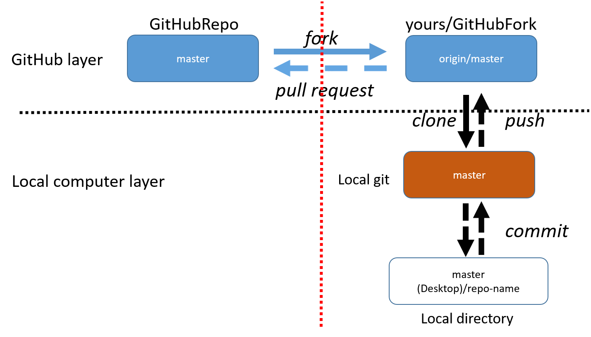

.. _Git and GitHub Procedures:

Git and GitHub Procedures
*************************

The purpose of this page is to document typical Git and GitHub workflows and to
serve as a cheat sheet for remembering the commands.  This page only covers the
basic aspects related to Git version control and how one uses GitHub to
contribute code.

Git and GitHub Background
=========================

As a code base evolves it will have existed in many versions.  Almost all modern
codes use some form of what is termed "version control" (VC) to manage these
versions.  Rather than attempting to do VC manually, most developers typically
employ some form of VC software.  Broadly speaking VC software provides two
main services:

1. Management of a code's history
   - Sophisticated "undo" feature
2. Merging disparate contributions into one code base
   - Manually merging contributions from different developers is error-prone
   - Good VC can merge code automatically by utilizing the common code history

Superficially all VC software follows a similar workflow.  When a developer
wants to work on a version controlled code base (called a repo), they:

1. Copy the repo
2. Modify the copy
3. Merge the copy back with the repo

Exactly how this process is done depends on the model adopted by the VC
software managing the repo.  Originally, most VC packages (like CVS and SVN)
utilized what is called a centralized repo model.  In a centralized model
there is only one repo.  Copies of that repo are intimately linked to the
original repo.  More modern VC packages, like Git and Mercurial, instead use
what is called a distributed repo model.  In this model, all copies of the
original repo are perfectly legitimate repos on their own.  Conceptually this
means that any notion of "authoritative repo" is purely a social convention.
The distributed repo model has a number of advantages compared to the
centralized repo model:

- Faster operations

  - No need to communicate with original (typically remote) repo
  - Encourages code-base to be saved more often
- Easy collaboration

  - No need for messy three-way (original, and two copies) synchronization,
    only worry about copy to copy synchronization
  - Copies have access to all VC commands, which makes it much easier to share
    changes without going through original repo
- Each repo is essentially a "back-up", the original repo's full history is in
  each copy

Given `GitHub <https://github.com/>`_'s current popularity as a social coding
platform it's easy to lose sight of GitHub's actual role in the VC process.
GitHub itself is really nothing more than a website which hosts Git repos.
Consequentially, there's nothing special (from the perspective of Git) about the
repo that lives on GitHub versus a copy of that repo living on any other
computer.  That said, given that GitHub is easily accessed by all developers and
potential users, it's typical to, by social convention, treat the GitHub repo as
the "official" repo.  GitHub's popularity is largely fueled by the fact that
in addition to being a place to host Git repos it also strives to encompass
and simplify many other aspects of the development process (such as continuous
integration and code-review).  The following sections detail common Git
commands and the typical GitHub workflow purposed for the NWChemEx project.

Common Git Commands
===================

For the purposes of this tutorial we'll assume that you're working with an
existing Git repo (if you're not, the easiest way to make a repo is to do so on
GitHub and then follow GitHub's prompts).  Once you know which repo you want
to work on, the first step is to get your own copy (the copy is termed a clone
in Git lingo).  The command to clone a repo is:

.. code-block:: bash

   git clone <path_to_repo> [<where_to_put_repo>]

This will checkout a repo that is located at ``path_to_repo`` and optionally
put it in a folder named ``where_to_put_repo`` (if you don't specify
``where_to_put_repo``, the clone will be placed into a folder with the
same name as the repo you are cloning).  It's important to realize that
``path_to_repo`` can be either a file path, to say clone a repo on your
internal network, or a website like GitHub.  The remainder of the commands in
this section assume you are inside the resulting directory (Git will try to
access settings that are hidden in ``.git/`` folders and will complain if said
folders don't exist).

Typically one thinks of the code itself as having a single state.  This state
evolves as features are added to the code.  The timeline of the code's state is
termed the "master branch" (history in Git is thought of as tree-like).  By
default the clone you get only has the master branch.  A widely adopted
convention of the Git community (adherence to which will make your life easier
long term) is that the master branch should always be deployable (*i.e.* work
and be relatively bug-free).  This convention is easy to meet if we always
keep this branch clean (*i.e.* don't make your changes to it) and we keep it
up to date. In an effort to keep the master branch clean the first
thing you should do is thus make a new branch.  This is done by:

.. code-block:: bash

   git checkout -b <branch_name>

where ``branch_name`` is the name of the branch you'll be working on.  The
``-b`` flag tells Git to make the branch (Git will yell at you if the branch
exists and you use the ``-b`` flag). The resulting branch starts a new timeline
that diverges from the master branch's current state.  All of your development
will occur on this branch.  Since the branch has diverged from the master branch
it is safe to routinely track your changes, even before they're ready to be
merged back into master.

At this point you begin developing your great new feature on your new branch.
As time goes by and you write more and more code, you'll reach a point where
you'll want to save the branch's state with Git so that you can revert if
something goes horribly wrong.  To do this, first you have to tell Git what
files you want to save:

.. code-block:: bash

   git add <files_to_save>

where ``files_to_save`` is one or more files to save (Linux wild cards work,
*e.g.* ``git add *.cpp`` will save all C++ source files in the current directory).
After this command, the state of the files is not saved yet (they are what is
typically referred to as staged).  The staging phase makes it easier for you to
fine tune what gets saved and what doesn't.  You can run ``git add`` as many
times as you want and keep amassing files to save.  It's useful to note that
you can get a wealth of information about the current repo's state via:

.. code-block:: bash

   git status

Among other things, this command will tell you which files are not versioned,
which versioned files are changed, but not staged, and which versioned files
are staged. Once you're happy with the set of staged files, you "commit" them
via:

.. code-block:: bash

   git commit -m "<message>"

This command will save all staged files to your branch and log the commit
with some (hopefully descriptive) message (if you omit the ``-m`` flag and the
message it'll bring up your text editor of choice so that you can type one).
After running this command your code's state is saved; however, the files are
only saved to your current branch, they are not saved to any other branch
(other branch notably including the master branch) or repo yet.

At some point you'll want to move your feature to another repo.  Typically this
other repo is the original repo you cloned.  Because we are now attempting to
partially synchronize two repos, there's a lot of possibilities for how we want
to do this.  In an effort to keep this simple, we note that 99.9% of the time,
using the GitHub workflow laid out below we want to synchronize a single branch
of each repo.  Moreover we want to synchronize the same branch (that is we
typically will not be directly merging into master as explained below).  For
simplicity we assume our current repo is on the branch we currently want to
synchronize (if you're not ``git checkout <branch_to_synch>``) and all changed
files have been committed.  Before we can synchronize, we have to make sure we
have all of the changes on the original repo's branch (if the original repo
doesn't have this branch yet, *i.e.* your commit will make it, skip this step;
as with most things Git will yell at you if you attempt to synchronize with a
non-existent branch or if that branch is ahead of yours). The command to "pull"
the other branch's changes is:

.. code-block:: bash

   git pull origin <branch_name>

``origin`` is an alias Git automatically defines for you, which points to the
original repo you cloned (obviously change origin if you're not synchronizing
with the original repo).  ``branch_name`` should be both the name of your current
branch and the name of the other repo's branch. It is possible for conflicts to
occur at this point, so it's worth discussing them now.  Git's pretty good about
merging contributions from multiple developers automatically.  Nevertheless
conflicts do occur.  If during a merge a conflict does occur, you'll have to
correct it manually. To do this take note of the conflicting files (if you
forget you can get the list again by running ``git status``).  For each file
you'll need to fix all conflicts contained within it.  Within the file, Git
will add three delimiters.  The conflicting lines of code will start with
``<<<<<<< HEAD`` and end with ``>>>>>>> branch_name`` delimiters.  In between
these delimiters ``=======`` will separate your changes (top half) from the
other repo's changes (bottom half).  To fix the conflict, you'll need to delete
the delimiters and manually merge the changes.  Once you've done that you
stage and then commit the file.  Finally, once all conflicts are fixed (if any
existed) you "push" your changes to the other repo:

.. code-block:: bash

   git push origin <branch_name>

While it's essential to keep the master branch of your repo clean, it's also
good practice to keep it synchronized with that of the repo you cloned (we'll
get to why in a moment).  Synchronization of the the master branch is akin to
the first half of the procedure we just outlined.  First (assuming you're
on your development branch and not the master branch) change to your master
branch:

.. code-block:: bash

   git checkout master

then pull the original repo's master branch via:

.. code-block:: bash

    git pull origin master

Since you're following this tutorial there'll be no problems with the merge
and everything will go swimmingly.  With your master branch up-to-date you'll
want to merge those changes into your active development branch. To do this,
check-out your development branch and run:

.. code-block:: bash

   git merge master

This will merge the contents of your repo's master branch into your current
branch.  Depending on how master has changed conflicts may occur; if they do,
you simply deal with them as we did above.

GitHub Workflow
===============

The commands from the previous section are complemented by several GitHub
extensions.  We explain these extensions in this section.  For the purposes
of this tutorial, let's say you want to contribute to a very creatively named
repo on GitHub called "GitHubRepo".  Well we've got two problems.  First, the
maintainers of "GitHubRepo" probably don't want you directly committing to
their code base without them first looking at your contribution ("looking at" is
typically automated to some extent).  Hence, they'll need to pull your changes
into a sandbox area and assess them before committing them.  This leads to the
second problem, you probably don't want them accessing your computer. GitHub has
purposed a solution, it's called forking.  Alls it is, is a fancy clone
procedure.  During forking GitHub clones "GitHubRepo" to your account (thereby
hosting the clone on GitHub itself).  We'll call the resulting clone
"GitHubFork". Basically "GitHubFork" is a buffer repo that you both can
access comfortably (as in the spirit of Git itself each fork is a legitimate
GitHub repo itself and can be forked too, great for allowing the workflow
described here to be done recursively for collaborations).  As for how to
fork, on "GitHubRepo"'s GitHub page just click the fork button at the top.

After forking, the Git procedure continues like normal.  You clone
"GitHubFork" to your local machine and checkout a new branch preserving
master.  To save yourself some typing later you'll want to define an alias for
"GitHubRepo" (origin will be set to "GitHubFork").  Typically this alias is
called "upstream".  To make this alias the command is:

.. code-block:: bash

   git remote add upstream <path_to_original_repo>

It is polite at this point to notify the maintainers of "GitHubRepo" that you're
going to work on this feature.  To do this you first push your development
branch to "GitHubFork".  Then on "GitHubFork"'s GitHub page you should see a
box pop up that says your branch's name and "compare and pull request" (if
not you can go to the branches tab and manually start a pull request).  A
pull request is just that, it's a request for the maintainers of "GitHubRepo" to
pull the specified branch into their repository.  Since you're opening this
PR (that's short for pull request and is a very prevalent abbreviation on
GitHub, so learn it) before finishing the code, it's customary to title the PR
something like "[WIP] Descriptive Title".  Here "WIP" stands for "work in
progress" (again common abbreviation) and tells the maintainers that it's not
ready yet.  You'll also need to provide a description of what your feature
does (many repos will provide a template that you should fill out to the best
of your ability).  Starting the PR early is a good idea as it provides you a
means of getting feedback along the way ranging from "don't bother doing
this, we don't want your feature" to "that's great, let us know if there's
any way we can help you get that implemented".  It also will be the place
where a code-review (the maintainers of the repo look at your code and make
comments on it) will occur.  By starting early the code-review can be done in
stages (assuming you regularly update "GitHubFork").

For the most part the remainder of the development cycle is pretty
standard.  The big exception is staying synchronized with "GitHubRepo".  Since
other developers who contribute to "GitHubRepo" aren't going to be nice
enough to push their changes to your fork of the repo, you can't just run the
pull command from the last section.  Hence, in order for you to stay
up-to-date with "GitHubRepo" you'll need to pull changes from its master
branch into your local master branch.  The command is similar (and the reason
we defined the "upstream" alias):

.. code-block:: bash

   git pull upstream master

With your local master branch synched, you'll then want to synch
"GitHubFork"'s master branch.  To do this you'll push the local changes to
"GitHubFork".  The command is:

.. code-block:: bash

   git push origin master

Although not strictly necessary, this step makes it easier for you to recover
should anything go wrong.  In particular let's say you accidentally modify your
local master branch.  By ensuring your "GitHubFork" master branch is a clean
copy of the "GitHubRepo"'s at some point in its history you can run (on your
master branch):

.. code-block:: bash

   git reset --hard origin/master

This command will delete all changes made to your current master branch, and
make it exactly equal to the state of "GitHubFork"'s master branch.  YOU WILL
ALMOST CERTAINLY LOSE WORK BY DOING THIS.  It's thus best to first checkout a
new branch, that is a copy of the current master branch, before executing this
command.

Once you're done developing you need to notify the "GitHubRepo" maintainers.
This is typically done in two ways.  First, the "[WIP]" tag is removed from
the title of your PR.  As this is easy to miss, you typically will also comment in
the PR "r2g" (short for ready to go).  Comments are a lot harder to miss.  At
this point the ball's in the maintainers court to accept your PR or provide
additional feedback of things that need fixing (which assuming you were
pushing to "GitHubFork" regularly, will hopefully not be a long list).  Once
the PR is approved either you or the maintainers will click on the "merge"
button provided by GitHub and your code will be merged.  That's it, your
feature is merged, the PR is closed, and you can delete your branch.  It is
recommended that the contributor clicks merge in order to avoid premature
merging (simply because the reviewer has accepted what's there doesn't mean
that the contributor is done contributing via that PR).

The image below summarizes the discussion above.  The left side of the red
line is the GitHub "official" repo.  On the right side of the red line are
the repos that you (the developer) own.  Above the black dotted line are the
repos on GitHub and below the black line are the repos that live locally on your
own computer (or other computers you are using).

Further Information
===================

There is much more to both GitHub and Git itself.  The following is a collection
of tutorials offering additional information on certain topics.

- `The Git Command <https://git-scm.com/docs/gittutorial>`_
- `GitHub Workflow <https://guides.github.com/introduction/flow/>`_
- `Forking a Repo on GitHub <https://guides.github.com/activities/forking/>`_
