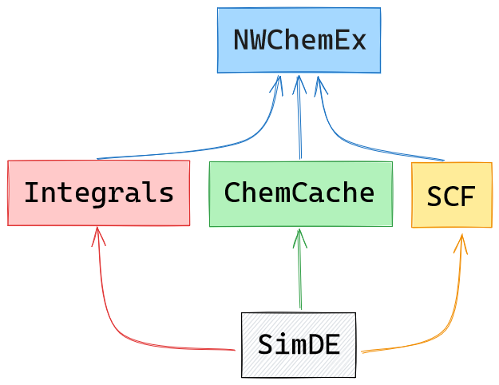
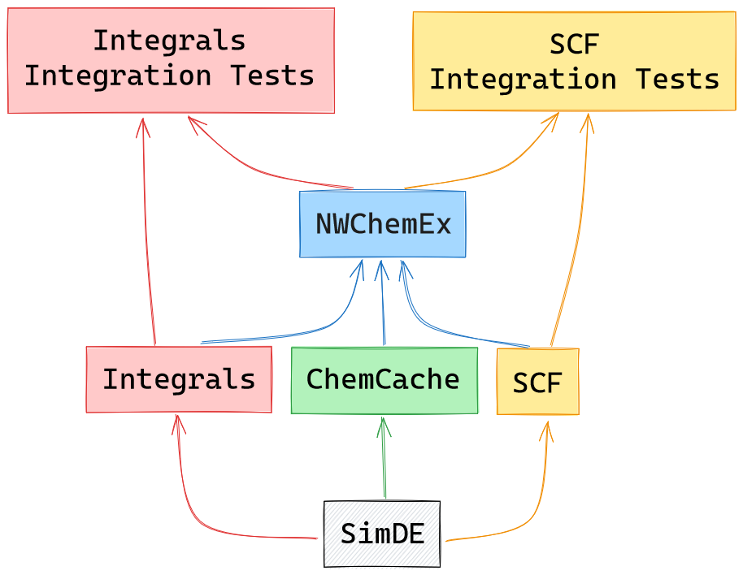

.. Copyright 2023 NWChemEx-Project
..
.. Licensed under the Apache License, Version 2.0 (the "License");
.. you may not use this file except in compliance with the License.
.. You may obtain a copy of the License at
..
.. http://www.apache.org/licenses/LICENSE-2.0
..
.. Unless required by applicable law or agreed to in writing, software
.. distributed under the License is distributed on an "AS IS" BASIS,
.. WITHOUT WARRANTIES OR CONDITIONS OF ANY KIND, either express or implied.
.. See the License for the specific language governing permissions and
.. limitations under the License.

.. _writing_integration_tests:

######################################
Writing Integration Tests for NWChemEx
######################################

NWChemEx is a modular ecosystem designed with separation of concerns as a key
design point. An example of this separation can be found with the 
SCF, integrals, ChemCache libraries. These components of NWX are linked by 
SimDE and are intended to be used together, but are not explicitly required for 
the development of the other (see :numref:`fig_deps_chart`). The unit tests for 
these libraries are intended to ensure basic functionality and correctness, 
which can usually be accomplished with simple test data that allow the unit 
tests to run quickly. 

.. _fig_deps_chart:

    A simplified diagram of the NWChemEx dependency structure. Note that Plugins
    depending on SimDE are parallel to one another, and are integrated together
    within NWChemEx. Arrows point from a dependency to the dependent library.

With that said, the initial development and testing of the SCF becomes very 
awkward when one is unable to easily acquire real integrals for real molecular 
systems. Additionally, changes to the integrals code could have deleterious
effects on the SCF code, which we would like to detect before merging. For these
(and other) reasons, it can be useful to implement integration tests to ensure
the continued interoperability of the isolated components of the NWX stack.
Because the tests are built on top of the Plugins, it is simple to include
NWChemEx itself as a dependency of the test (see :numref:`fig_integration_chart`).
This way, changes at the Plugin level can be screened to guarantee that they
don't break interoperability with the others.

.. _fig_integration_chart:

    A diagram illustrating the relationship between the integration tests, the
    library they test, and the top-level NWChemEx library. Arrows point from a 
    dependency to the dependent library.

CMake for Integration Testing
=============================

The following code-block provides an example for how one can add the option for
an integration test to a project that uses the NWX ecosystem.

.. code-block:: CMake

    # Include option
    cmaize_option_list(
        BUILD_INTEGRATION_TESTS ON "Build the integration tests?"
    )

    # How to build the integration tests
    if("${BUILD_INTEGRATION_TESTS}")
        include(nwx_pybind11)
        # Set relevant test directories
        set(CXX_INCLUDE_DIR /path/to/cxx/includes)
        set(CXX_TEST_DIR /path/to/cxx/integration/tests)
        set(PYTHON_TEST_DIR /path/to/python/integration/tests)

        # Build NWChemEx for the test
        cmaize_find_or_build_dependency(
            nwchemex
            URL github.com/NWChemEx/NWChemEx
            VERSION master
            BUILD_TARGET nwchemex
            FIND_TARGET nwx::nwchemex
            CMAKE_ARGS BUILD_TESTING=OFF
                       BUILD_PYBIND11_PYBINDINGS=ON
        )

        # Add integration tests
        nwx_pybind11_tests(
            py_test_integration_scf
            "${PYTHON_TEST_DIR}/test_main.py"
            SUBMODULES parallelzone pluginplay chemist simde chemcache friendzone nwchemex
        )
    endif()

Integration Tests
=================

Building on the description provided in :ref:`writing_unit_tests`, integration
tests are written in the same manner. Below is an example of how to use NWChemEx
in our new integration test to acquire input values and submodules that may be
needed by a module in our project.

.. code-block:: python

    import unittest
    import nwchemex
    import scf
    from pluginplay import ModuleManager
    from simde import AOEnergy
    from simde import MoleculeFromString
    from simde import MolecularBasisSet

    class TestIntegration(unittest.TestCase):

        def test_scf_module(self):
            # Module we want to test
            key = "SCF Module"

            # Property Types from SimDE
            molecule_pt = MoleculeFromString()
            basis_set_pt = MolecularBasisSet()
            energy_pt = AOEnergy()

            # Can use NWChemEx modules to get inputs
            mol = self.mm.run_as(molecule_pt, "NWX Molecules", "water")
            bs = self.mm.run_as(basis_set_pt, "sto-3g", mol)

            # set NWChemEx modules as needed submodules
            submod_key = "A submodule of my SCF module"
            integral_key = "Some integral needed to run SCF"
            mm.change_submod(key, submod_key, integral_key)

            # Test our module
            egy = self.mm.run_as(energy_pt, key, mol, bs)
            self.assertAlmostEqual(egy, 3.14159265359, places=6)

        def test_another_module(self):
            # Add more tests where appropriate
            pass

        def setUp(self):
            self.mm = ModuleManager()
            nwchemex.load_modules(mm) # Also loads out SCF modules

